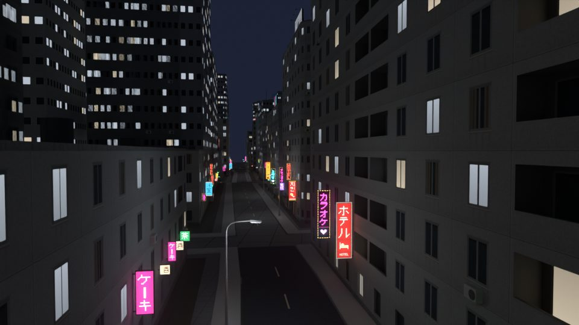

# Mapcast

**English** · [简体中文](README.zh-CN.md)



Turn a real street block from OpenStreetMap into a PS2-style city scene: concrete panel blocks, pixel-art facades and neon street signs. Pick an area on a map and get a single `city.glb` file to open in Blender, Unreal Engine or any glTF tool.

The map sets the layout: streets, building footprints and heights. Everything else is procedural: windows, shopfronts, signs, lamps and street props. The result is a starting point for video sequences and simple first-person scenes. It is not a faithful reconstruction of the real place.

- **Low-poly, low-resolution:** shared 512 px texture atlases with nearest-neighbour filtering. Upper floors are painted, not modelled.
- **Day and night:** lit windows, signs, lamps and vending machines use emissive materials with `KHR_materials_emissive_strength`, so bloom works in Blender and Unreal.
- **Original signage:** all sign text and icons are hand-drawn pixel art in the repository. There are no real brands and no font files.
- **Runs locally:** scenes are generated on your machine. The network is only used to download map data and, on the web page, for the background map and place search (OpenStreetMap and Nominatim). No AI services and no cloud rendering.

## Quick start

Requires [Node.js](https://nodejs.org/) 22 or newer.

```bash
npm ci
npm start
```

Open <http://127.0.0.1:4173/>:

1. Search a place, pick one of the examples, or draw a box or four corners on the map.
2. Choose the detail level.
3. Click **Generate scene**.
4. Check the model in the 3D preview, then download `city.glb`.

The page is available in English and Chinese.

From the command line, bounds are given as west, south, east, north (longitude, latitude, longitude, latitude):

```bash
node src/cli.mjs --bbox 13.401,52.527,13.407,52.531 --out output/berlin
```

To try it without downloading anything, run it on the bundled synthetic block:

```bash
node src/cli.mjs --input examples/block.json --out output/demo
```

## Options

| Option | Values | |
| --- | --- | --- |
| `--bbox` | `west,south,east,north` | Area to download. Diagonal up to 1 km (Map API) or 3 km (Overpass). |
| `--area` | `"lon,lat lon,lat lon,lat lon,lat"` | Instead of `--bbox`: four corners of a convex area, for street grids that run at an angle. |
| `--input` | file | Local GeoJSON or Overpass JSON instead of downloading. |
| `--out` | folder | Output folder. Generated files there are overwritten. |
| `--provider` | `map-api` (default), `overpass` | Where map data comes from. |
| `--offline` | | Use cached data only; never touch the network. |
| `--detail` | `full` (default), `lite` | `lite` paints every facade from the atlas and drops street props. The file is roughly a third smaller. |
| `--textures` | folder | Replacement textures (default `overrides/textures/`). See [textures](docs/textures.md). |

Downloads are cached in `cache/`. Add `--refresh` to download again. See [map data](docs/map-data.md) for sources, caching and local input.

## What you get

| File | |
| --- | --- |
| `city.glb` | The scene with textures embedded. Metres, Y up, X east, −Z north. |
| `textures/` | The generated textures as PNG files, for reference or replacement. |
| `metadata.json` | Origin coordinates, generation rules and a record of every sign, prop and entrance placed. |
| `source-index.json`, `source-map.svg` | Which OSM objects were used or skipped, and why. |
| `preview-*.png` | Quick still previews. They are not final renders. |
| `ATTRIBUTION.txt` | Data sources and required credits. |

A 400 × 450 m block in Berlin (307 buildings) comes out at about 297,000 triangles and 29 MB. A dense Hong Kong block is 51 MB in full detail and 33 MB in lite.

Import notes for [Blender and Unreal Engine](docs/blender-unreal.md).

## Documentation

- [How scenes are generated](docs/generation.md): building types, facades, height estimates, signs, props, lamps, and the known limits
- [Map data](docs/map-data.md): sources, cache, offline mode, local files
- [Replacing textures](docs/textures.md): your own billboard art, vending machines, and any other atlas
- [Blender and Unreal Engine](docs/blender-unreal.md)
- [Development](docs/development.md): project layout, tests and audit tools

## Data and credits

Map data © [OpenStreetMap contributors](https://www.openstreetmap.org/copyright), available under the [Open Database License](https://opendatacommons.org/licenses/odbl/1-0/). Every generated scene includes an `ATTRIBUTION.txt`. When you publish work made with it, credit OpenStreetMap as the licence requires.

## License

The code is released under the [MIT License](LICENSE). Scenes you generate are yours to use; the OpenStreetMap credit above still applies to the map data in them.
