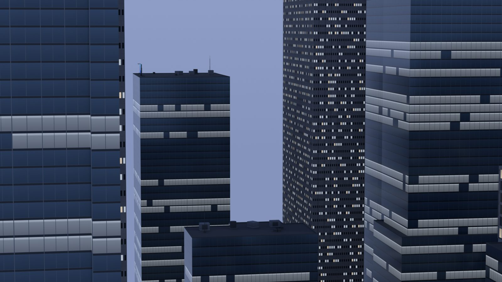
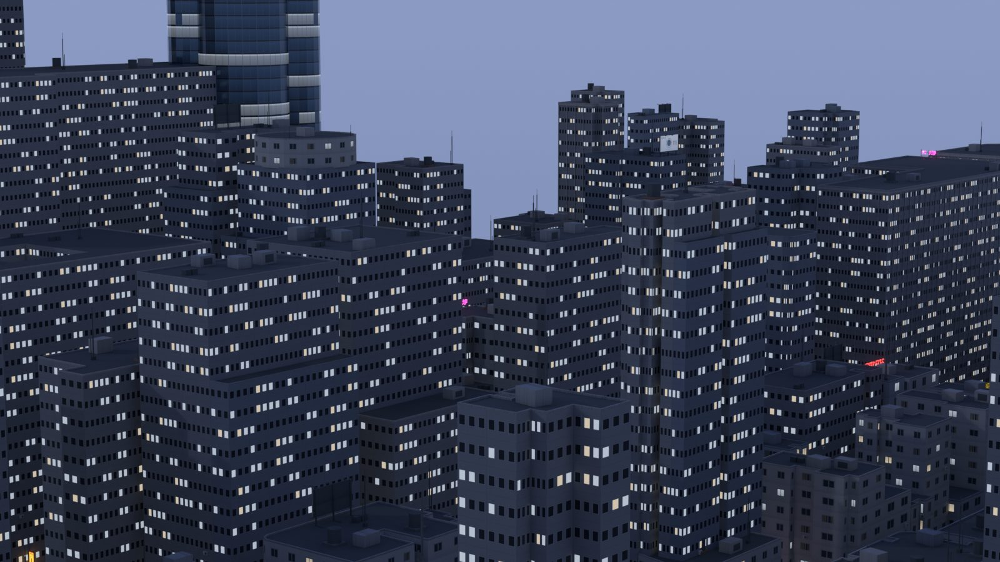

# Mapcast

[English](README.md) · **简体中文**

<p>
  
  
</p>

把 OpenStreetMap 上的一块真实街区变成 PS2 风格的城市场景，包括混凝土板楼、像素贴图立面和霓虹招牌。在地图上框选区域，得到一个 `city.glb`，可以直接导入 Blender、Unreal Engine 或任何支持 glTF 的工具。

地图提供布局：街道、建筑轮廓和高度。窗户、店面、招牌、路灯和街道道具是程序生成的。生成结果适合作为视频镜头和简单第一人称场景的起点，它不是对真实地点的精确还原。

- **低模、低分辨率：** 共享 512 px 贴图集，最近邻过滤。二层以上用贴图表现，不建模。
- **白天与夜景：** 亮灯窗、招牌、路灯和售货机使用自发光材质（`KHR_materials_emissive_strength`），在 Blender 和 Unreal 中可以直接触发 bloom。
- **原创招牌：** 所有招牌文字和图标都是仓库内手绘的像素图，不含真实品牌，也不使用字体文件。
- **本地运行：** 场景在本机生成。联网只用于下载地图数据，以及网页上的底图和地点搜索（OpenStreetMap 与 Nominatim）。不使用 AI 服务，也不依赖云端渲染。

## 快速开始

需要 [Node.js](https://nodejs.org/) 22 或更新版本。

```bash
npm ci
npm start
```

打开 <http://127.0.0.1:4173/>：

1. 搜索地点、选择示例区域，或在地图上框选矩形、点选四个角。
2. 选择细节级别。
3. 点击**生成场景**。
4. 在 3D 预览中检查模型，然后下载 `city.glb`。

网页支持中文和英文。

命令行的边界顺序为西、南、东、北，即经度、纬度、经度、纬度：

```bash
node src/cli.mjs --bbox 13.401,52.527,13.407,52.531 --out output/berlin
```

也可以不下载地图，直接用自带的合成街区试一下：

```bash
node src/cli.mjs --input examples/block.json --out output/demo
```

## 选项

| 选项 | 取值 | |
| --- | --- | --- |
| `--bbox` | `西,南,东,北` | 要下载的区域。对角线上限为 1 km（Map API）或 3 km（Overpass）。 |
| `--area` | `"经度,纬度 经度,纬度 经度,纬度 经度,纬度"` | 代替 `--bbox`：凸四边形的四个角，适合斜向的街道网格。 |
| `--input` | 文件 | 使用本地 GeoJSON 或 Overpass JSON，不下载。 |
| `--out` | 目录 | 输出目录。目录中已生成的文件会被覆盖。 |
| `--provider` | `map-api`（默认）、`overpass` | 地图数据来源。 |
| `--offline` | | 只用缓存，完全不联网。 |
| `--detail` | `full`（默认）、`lite` | `lite` 精简模式：全部立面用贴图，不放街道道具，文件约小三分之一。 |
| `--textures` | 目录 | 替换贴图（默认 `overrides/textures/`），见[替换贴图](docs/textures.md)。 |

下载的数据缓存在 `cache/`，加 `--refresh` 可以重新下载。数据来源、缓存和本地输入见[地图数据](docs/map-data.md)。

## 输出内容

| 文件 | |
| --- | --- |
| `city.glb` | 内嵌贴图的场景。单位为米，Y 轴向上，X 向东，−Z 向北。 |
| `textures/` | 生成的 PNG 贴图，供参考或替换。 |
| `metadata.json` | 原点坐标、生成规则，以及每个招牌、道具和入口的放置记录。 |
| `source-index.json`、`source-map.svg` | 哪些 OSM 对象被使用、哪些被跳过，以及原因。 |
| `preview-*.png` | 快速静态预览，不是最终渲染。 |
| `ATTRIBUTION.txt` | 数据来源与署名要求。 |

柏林一块 400 × 450 米的街区（307 栋建筑）约 29.7 万个三角面，文件约 29 MB。香港的一块密集街区完整模式为 51 MB，精简模式为 33 MB。

导入说明见 [Blender 与 Unreal Engine](docs/blender-unreal.md)。

## 文档

详细文档目前只有英文：

- [场景如何生成](docs/generation.md)：建筑类型、立面、高度推定、招牌、道具、路灯与已知限制
- [地图数据](docs/map-data.md)：数据来源、缓存、离线模式、本地文件
- [替换贴图](docs/textures.md)：自己的广告图、售货机，以及其他贴图集
- [Blender 与 Unreal Engine](docs/blender-unreal.md)
- [开发](docs/development.md)：项目结构、测试与检查工具

## 数据与署名

地图数据 © [OpenStreetMap 贡献者](https://www.openstreetmap.org/copyright)，采用 [开放数据库许可（ODbL）](https://opendatacommons.org/licenses/odbl/1-0/)。每个生成结果都附带 `ATTRIBUTION.txt`。发布用它制作的作品时，请按许可要求注明 OpenStreetMap。

## 许可证

代码采用 [MIT 许可证](LICENSE)。生成的场景可以自由使用，但其中的地图数据仍需按上文要求注明 OpenStreetMap。
